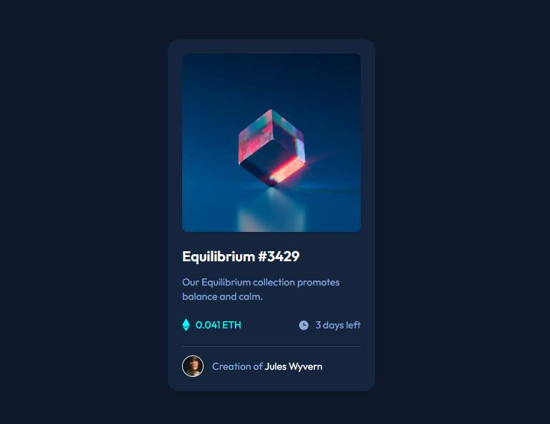
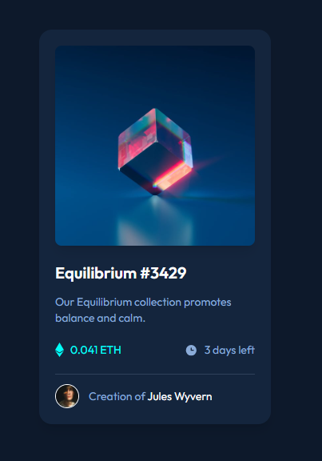

# Frontend Mentor - NFT preview card component solution

This is a solution to the [NFT preview card component challenge on Frontend Mentor](https://www.frontendmentor.io/challenges/nft-preview-card-component-SbdUL_w0U). Frontend Mentor challenges help you improve your coding skills by building realistic projects. 

### The challenge

Users should be able to:

- View the optimal layout depending on their device's screen size
- See hover states for interactive elements

### Screenshot

Here are the screehshots of my solution for this challenge:

### Links

- Solution URL: [Add solution URL here](https://your-solution-url.com)
- Live Site URL: [Add live site URL here](https://your-live-site-url.com)

### Built with

- Semantic HTML5 markup
- CSS custom properties
- Flexbox
- CSS Grid
- Mobile-first workflow
- [Tailwind css](https://tailwindcss.org/) - CSS framework for styling

### What I learned

By completing this challenge i learned how to create a responsive card component using tailwind css.

### Continued development

I would like to be able to build responsive websites with tailwind css and react js.

## Author

- Website - [Rafiullah Ahmadi]
- Frontend Mentor - [@Ahmadi1798](https://www.frontendmentor.io/profile/Ahmadi1798)
- Twitter - [@rafillah_rafat](https://www.twitter.com/rafillah_rafat)

